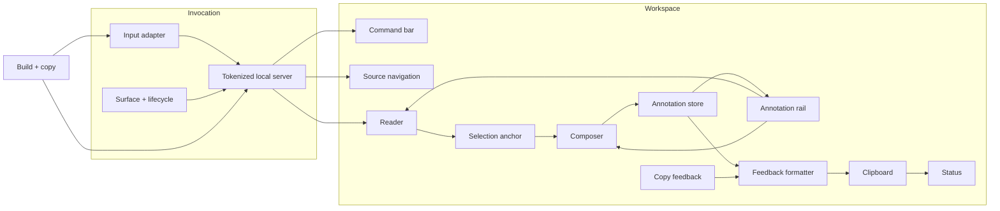

# Embedded Review Workspace — Shaping

## Requirements (R)

| ID | Requirement | Status |
| --- | --- | --- |
| R0 | Review the latest assistant response or a requested code diff in a focused annotation workspace. | Core goal |
| R1 | Each skill is self-contained and does not require a system-wide Plannotator runtime, hook, extension, or service. | Must-have |
| R2 | `review-last` targets the active Pi branch exactly; `review-diff` shows the exact local or supplied PR/MR patch selected by its adapter. | Must-have |
| R3 | Render assistant Markdown clearly and render code diffs with `@pierre/diffs` 1.2.8. | Must-have |
| R4 | Let users annotate Markdown text selections and diff line ranges, then edit, delete, undo, and navigate those comments. | Must-have |
| R5 | Produce deterministic, paste-ready Markdown feedback through an explicit clipboard action; do not inject feedback into an agent session. | Must-have |
| R6 | Provide a complete keyboard workflow, including vi movement, visible focus, reduced-motion support, and responsive layout. | Must-have |
| R7 | Use Glimpse as the Pi-native window when available and the same tokenized localhost workspace in a browser otherwise. | Must-have |
| R8 | Keep the workspace local and read-only: no staging, remote review posting, AI, uploads, telemetry, or background feedback delivery. | Must-have |

## Shapes

### A: Embedded local review workspace

| Part | Mechanism | Flag |
| --- | --- | :---: |
| A1 | Each skill ships an identical Node launcher, static application bundle, and third-party notices. The launcher binds an ephemeral server to `127.0.0.1` behind a random path token. | |
| A2 | `review-last` extracts the previous assistant text from Pi's active persisted parent chain and accepts an explicit file/stdin fallback. `review-diff` captures local Git changes or a supplied GitHub/GitLab patch without mutation. | |
| A3 | A vanilla TypeScript application renders safe Markdown and `@pierre/diffs` 1.2.8, with one annotation model for text anchors, line ranges, and file comments. | |
| A4 | A keyboard-first shell manages comments and formats them into stable Markdown copied locally through Clipboard API with a selection fallback. | |
| A5 | The build pipeline bundles all browser dependencies with esbuild, copies the runtime into both skills, and verifies the copies are byte-identical. | |

### B: Pinned upstream Plannotator runtime

| Part | Mechanism | Flag |
| --- | --- | :---: |
| B1 | Skill launchers download and verify an upstream Plannotator binary, then invoke its `last` or `review` command. | |
| B2 | Pi session parsing supplies the last assistant response through upstream stdin support. | |

### C: Pi extension bridge

| Part | Mechanism | Flag |
| --- | --- | :---: |
| C1 | A Pi extension uses `ctx.sessionManager.getBranch()` and launches Plannotator's embedded editor through its event API. | |
| C2 | The extension returns or injects completed feedback into Pi. | |

## Fit Check

| Req | Requirement | Status | A | B | C |
| --- | --- | --- | :---: | :---: | :---: |
| R0 | Review the latest assistant response or a requested code diff in a focused annotation workspace. | Core goal | ✅ | ✅ | ❌ |
| R1 | Each skill is self-contained and does not require a system-wide Plannotator runtime, hook, extension, or service. | Must-have | ✅ | ❌ | ❌ |
| R2 | `review-last` targets the active Pi branch exactly; `review-diff` shows the exact local or supplied PR/MR patch selected by its adapter. | Must-have | ✅ | ✅ | ✅ |
| R3 | Render assistant Markdown clearly and render code diffs with `@pierre/diffs` 1.2.8. | Must-have | ✅ | ✅ | ✅ |
| R4 | Let users annotate Markdown text selections and diff line ranges, then edit, delete, undo, and navigate those comments. | Must-have | ✅ | ✅ | ✅ |
| R5 | Produce deterministic, paste-ready Markdown feedback through an explicit clipboard action; do not inject feedback into an agent session. | Must-have | ✅ | ✅ | ❌ |
| R6 | Provide a complete keyboard workflow, including vi movement, visible focus, reduced-motion support, and responsive layout. | Must-have | ✅ | ❌ | ❌ |
| R7 | Use Glimpse as the Pi-native window when available and the same tokenized localhost workspace in a browser otherwise. | Must-have | ✅ | ❌ | ❌ |
| R8 | Keep the workspace local and read-only: no staging, remote review posting, AI, uploads, telemetry, or background feedback delivery. | Must-have | ✅ | ❌ | ❌ |

**Notes:**

- B depends on a large external runtime whose review surface includes mutable and networked capabilities; it also does not guarantee the requested keyboard contract.
- C is Pi-only and its upstream lifecycle delivers feedback asynchronously instead of manual copy/paste.

**Selected:** A.

## Detail A: UI Affordances

| ID | Place | Affordance | Wires out |
| --- | --- | --- | --- |
| U1 | Command bar | Review title, source label, annotation count | Reads N4; focuses U4/U5 |
| U2 | Command bar | `Copy feedback` button and `y` shortcut | N6 → N7 → U8 |
| U3 | Command bar | `Close review` and shortcut help | N2; opens U9 |
| U4 | Source navigator | File list/filter or Markdown outline | N3 → U5 |
| U5 | Reader | Safe rendered Markdown or Pierre diff | Selection → N5; comment navigation target |
| U6 | Composer | Anchor summary, labeled textarea, add/update action | N5 → N4 |
| U7 | Annotation rail | Ordered provenance, comment text, edit/delete/undo | N4 → U5/U6; mutates N4 |
| U8 | Status region | Copy/save/error announcement | N7 |
| U9 | Shortcut dialog | Pointer and keyboard command reference | Closes to prior focus |
| U10 | Narrow layout | Annotation drawer and file selector | Mirrors U4/U7 |

## Detail A: Non-UI Affordances

| ID | Place | Affordance | Wires out |
| --- | --- | --- | --- |
| N1 | Launcher | Mode-specific input adapter (`last` or `diff`) | Produces N3 |
| N2 | Launcher | Glimpse detection, browser fallback, lifecycle wait | Opens N3 URL; closes process |
| N3 | Local server | Tokenized static assets and immutable session payload | Hydrates U1/U4/U5 |
| N4 | Browser state | Session-local annotation store keyed by content hash | Drives U1/U7; restores within the active browser origin |
| N5 | Browser state | Text-quote or Pierre line-range selection anchor | Opens U6; highlights U5 |
| N6 | Browser state | Stable feedback formatter | Produces Markdown |
| N7 | Browser transport | Clipboard API with hidden-textarea fallback | Reports U8 |
| N8 | Build | esbuild bundle plus deterministic asset copier | Supplies both skills |

## Wiring

