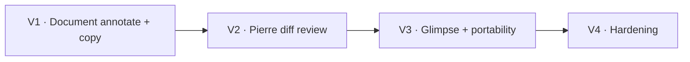

# Embedded Review Workspace — Slices

## V1: Review-annotate document loop

**Demo:** invoke `/skill:review-annotate last` or `/skill:review-annotate <path>`, switch lazily loaded files when applicable, annotate Markdown/plain/HTML transcript text, press `y`, and paste file-grouped feedback.

| Affordances | Scope |
| --- | --- |
| N1, N2, N3 | Pi active-branch or exact local path input, browser surface, tokenized lazy document server |
| U1, U2, U3, U4, U5, U6, U7, U8, U9 | Document browser, safe readers, document-aware anchors, comments, keyboard loop, copy and close |
| N4, N5, N6, N7, N8 | Draft state, formatter, clipboard fallback, bundled assets |

## V2: Review-diff annotation loop

**Demo:** invoke `review-diff` in a dirty repository, switch files, select a Pierre line range, comment, and copy file/line-addressed feedback.

| Affordances | Scope |
| --- | --- |
| N1 | Read-only local Git and PR/MR patch adapters |
| U4, U5, U6, U7, U10 | File navigation, Pierre rendering, line-range anchors, responsive rail |
| N4, N5, N6 | Diff annotation state and formatting |

## V3: Native Pi surface and portability

**Demo:** the same built skills open in Glimpse when detected and fall back to a browser when absent; explicit local paths remain available without stdin or URL ingestion.

| Affordances | Scope |
| --- | --- |
| N2 | Optional Glimpse module discovery and native lifecycle |
| N1 | Exact local file/folder path input for non-Pi harnesses; `last` remains Pi-only |
| N8 | Identical self-contained runtime in both skill directories |

## V4: Production hardening

**Demo:** keyboard-only use, 200% zoom, narrow layout, empty/error/large input states, and no-network runtime verification all pass.

| Affordances | Scope |
| --- | --- |
| U1–U10 | Focus, state coverage, reduced motion, responsive behavior, copy clarity |
| N1–N8 | Input limits, CSP/host checks, cleanup, unit/integration tests, license notices |

## Slice Wiring

