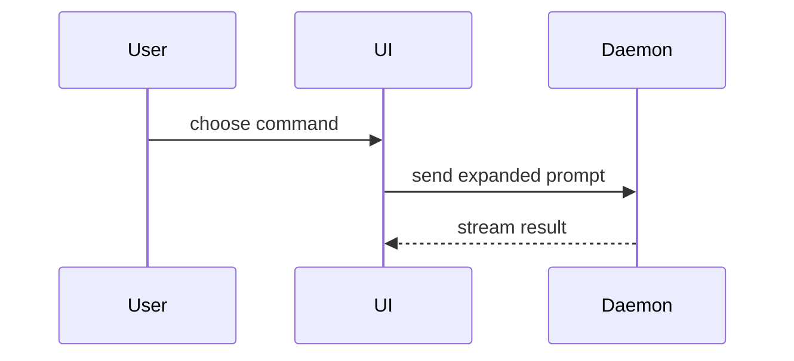

# Visual forms

Choose only the forms that reduce explanation time.

## Pseudocode

Use for logic or algorithms.

```text
on(save)
  if content is unchanged
    return cached result
  write new content
  return fresh result
```

## Call tree

Use for runtime control flow.

```text
submitForm
  createSession
    persistPrompt
    launchAgent
  navigateToSession
```

## Component tree

Include state and module boundaries that matter.

```tsx
<SessionPage> (apps/example/src/routes/session.tsx)
  useSessionEvents()
  <SessionToolbar>
    <RunSkillButton> (packages/ui)
```

## File tree

Use for responsibility or a broad refactor.

```text
src/
├── commands/       # parses user actions
├── sessions/       # owns session state
└── transport/      # sends API requests
```

## Mermaid

Use for multi-component interactions or data flow.



## Diff

Use when the point is what changes and the surrounding shape already exists. Match the diff shape to the topic.

```diff
 <SessionPage>
   useSessionEvents()
   <SessionToolbar>
+    <RunSkillButton />
   <SessionTimeline>
+    <SkillResultCard />
```

```diff
 src/
 ├── commands/
+│   └── show-me.ts       # expands the command
 ├── sessions/
-└── transport.ts
+└── transport/
+    ├── client.ts
+    └── stream.ts
```

```diff
 on(save)
-  write content
+  if content is unchanged
+    return cached result
+  write new content
+  invalidate cache
```

## Whole block

Show the whole block when most of it is new, omitted context would hide ownership or order, or the user needs a copyable target shape.

```ts
function expandSkill(command: string): string {
  const skillName = command.slice(1)
  return `use the ${skillName} skill`
}
```
